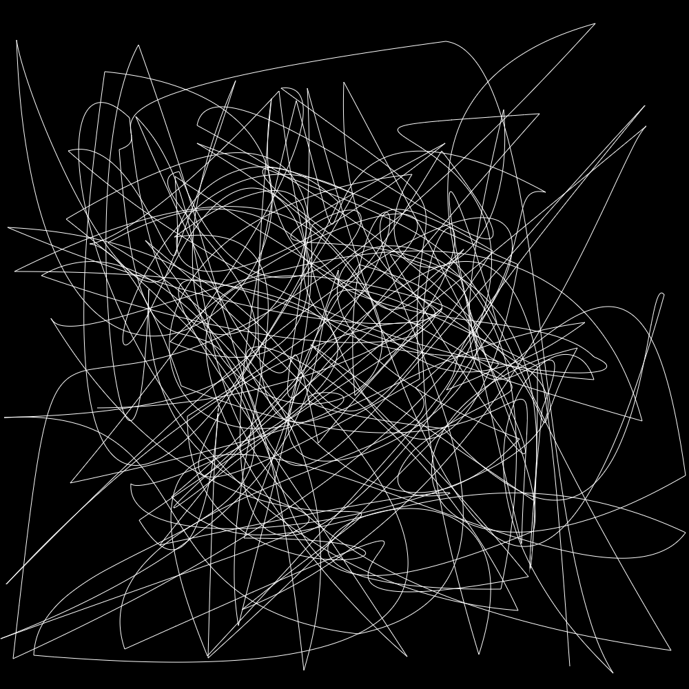
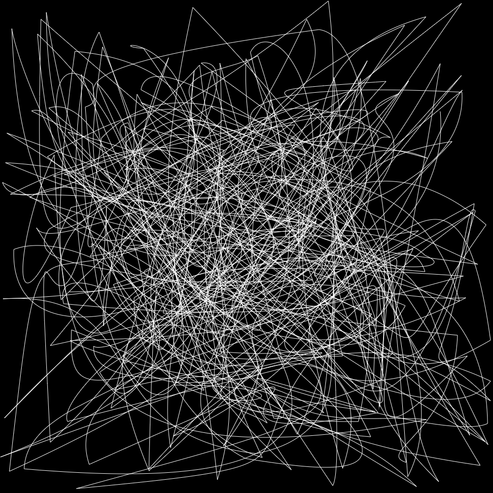
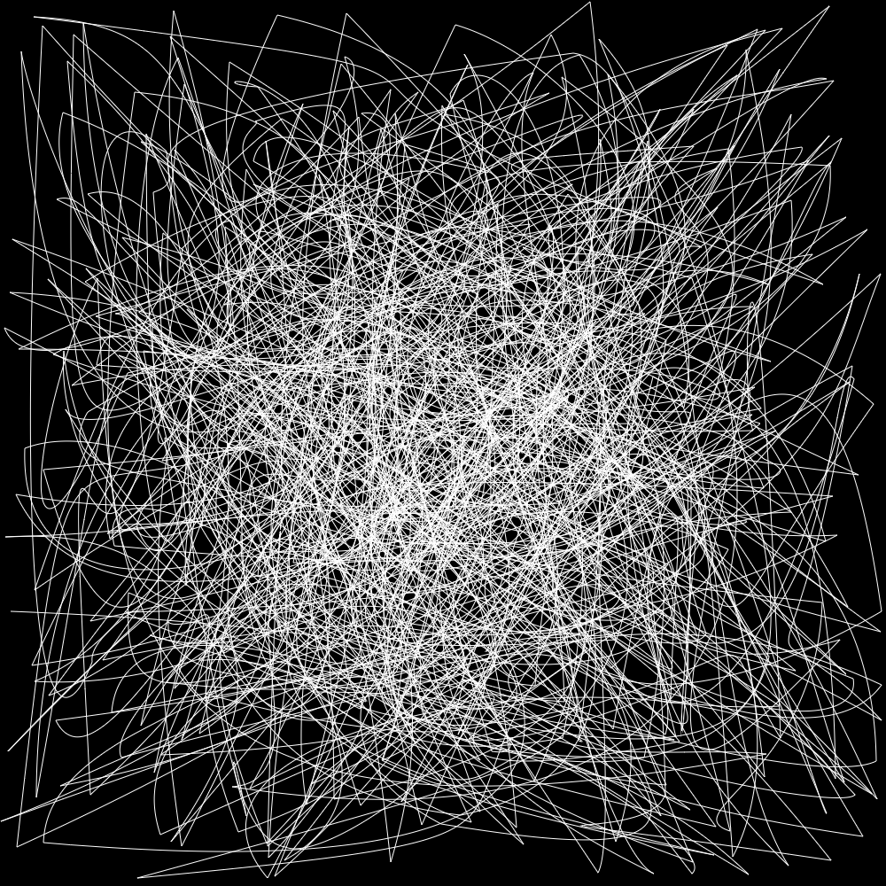
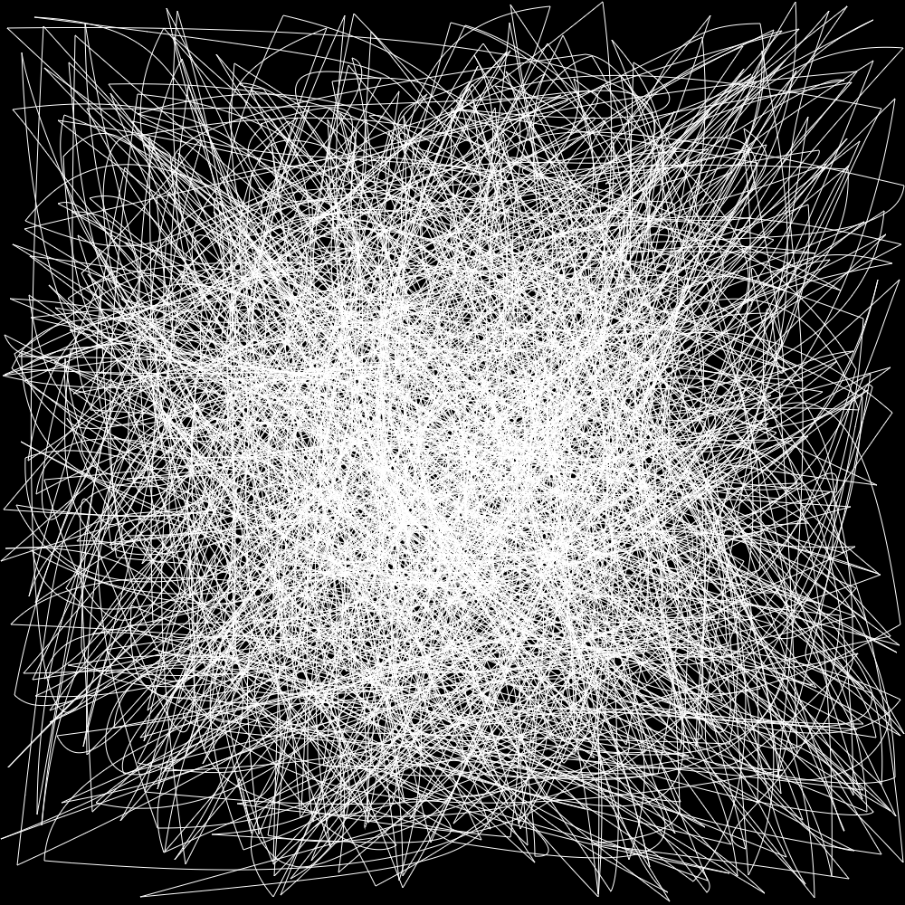

# PI Day 2022

This year for π day, I wanted to try visualizing π in a unique way. So I deicded to use bezier curves. 

## How it works

I load in the digits from pi.txt. I then remove the "3." and split the string into 3 digit segments.
Each 3 digit segment is then cast to an int. From there we loop over the segments, reading 8 at a time.
The 8 segments are put into a bezierSet data class to be used later. I then move 6 segments so that the
end of the previous bezier is the start of the next bezier. Then to add a little pop, the draw loop takes
the data from the bezierSets and renders them, increasing the number rendered by 1 each frame.

## Some Examples

#### 1,800 Digits

#### 3,600 Digits

#### 7,200 Digits

#### 14,400 Digits

#### 1st Million Digits

